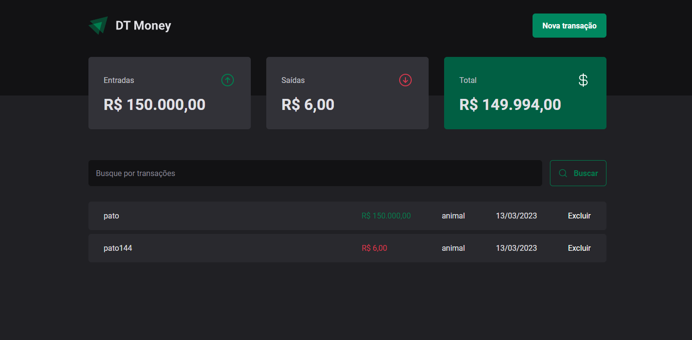

<!DOCTYPE html>
<html lang="en">
<head>
    <meta charset="UTF-8">
    <meta http-equiv="X-UA-Compatible" content="IE=edge">
    <meta name="viewport" content="width=device-width, initial-scale=1.0">
    <title>Document</title>
</head>
<body>
    

        <h1>DT Money</h1>
        <h2>Linguagens usados</h2>
        °ReactJs
        °TypeScript
        °Css
        °Styled-Components
        

            
        

    

</body>
</html>

# DT Money

DT Money é um projeto desenvolvido em React com o objetivo de controlar as finanças pessoais do usuário. O projeto utiliza Typescript e CSS para estilização.

## Funcionalidades

O DT Money possui as seguintes funcionalidades:

- Adição de transações, com campos para descrição, valor e tipo (entrada ou saída)
- Listagem das transações, com destaque para a soma total de entradas e saídas
- Cálculo automático do saldo final, subtraindo o total de saídas do total de entradas
- Separação das transações por tipo, com cores diferentes para transações de entrada e saída

## Design

O design do DT Money é simples e intuitivo, com predominância de cores verde e roxo. A página inicial apresenta um título e um botão para adicionar nova transação. Logo abaixo, são exibidas as transações já cadastradas, divididas em duas categorias: entradas e saídas. Cada transação possui uma cor de acordo com o tipo (verde para entradas e vermelho para saídas), e um ícone que indica a ação de editar ou excluir.

A página de adição de transação possui campos para descrição, valor e tipo, com opções para entrada ou saída. O botão de adicionar só fica habilitado quando todos os campos estiverem preenchidos.

## Contexto

O DT Money utiliza o Context API do React para gerenciar as informações das transações. O contexto é utilizado para armazenar as transações cadastradas, e é atualizado automaticamente conforme novas transações são adicionadas ou removidas. O contexto é utilizado pelos componentes filhos para exibir as informações de forma organizada e coerente.

## Conclusão

O DT Money é uma aplicação útil e simples para controle de finanças pessoais, com um design intuitivo e de fácil utilização. O uso do React com Typescript e CSS garante uma estrutura de código organizada e facilmente escalável, enquanto o Context API facilita o gerenciamento das informações das transações.